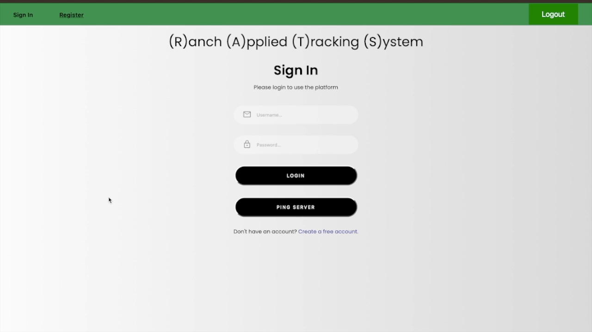
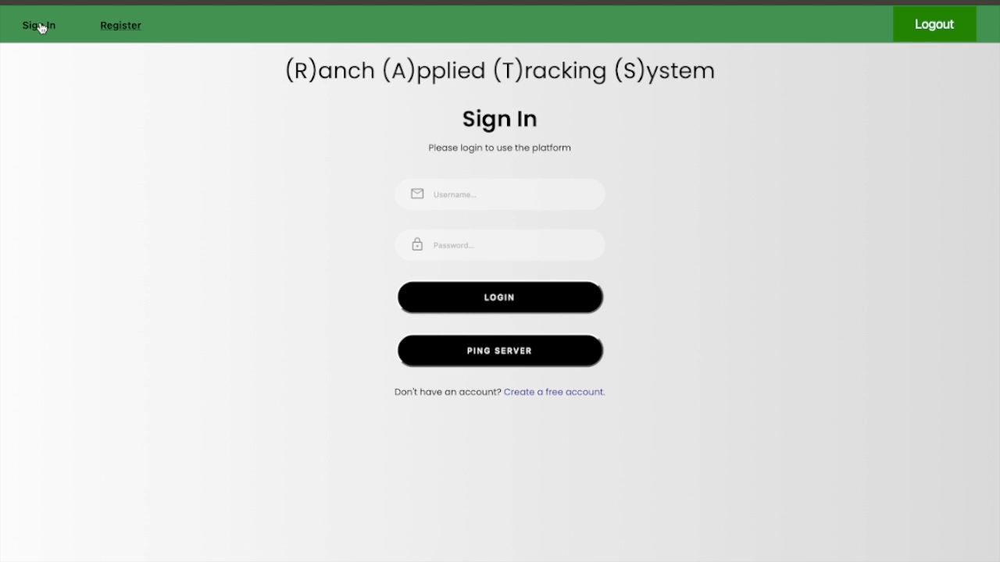
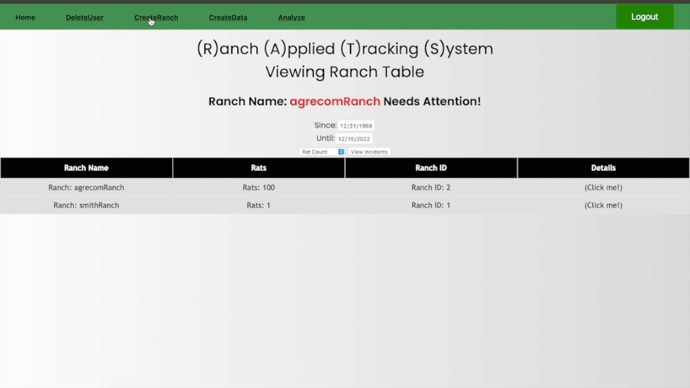
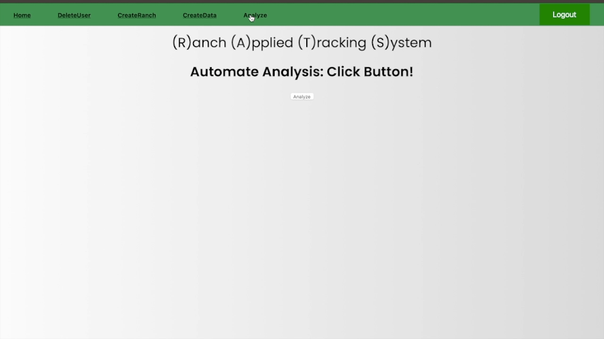
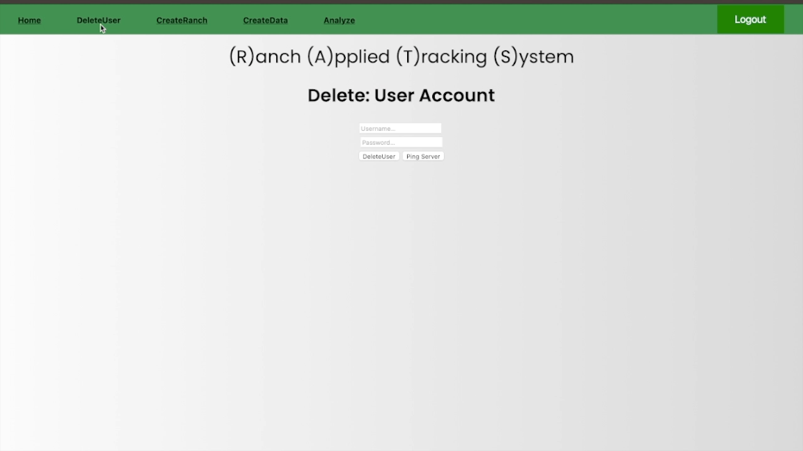

# AGRECOM 
### 8. Smart Rodent Detection
### Authors: Anson Yu, Gerado Garduno, Matthew Randolph, Milan Overholtzer, Torrance Zhou, Mike Monokandilos

# Abstract
Agrecom provides a spectrum of solutions in the areas of water treatment and sanitation, targeting clients in agriculture, residential, and commercial sectors. Agrecom lacks a centralized system that would rapidly transform client data into actionable information, replacing their obsolete method of manual classification. Our product is designed to identify critical areas of rodent activity, by inputting a parent Ranch folder into Amazon’s Machine Learning Rekognition Engine Model, which then outputs the total number of rats captured, per camera. Upon storing these statistics into the AWS RDS database, our cloud-based web-server then polls and displays a map that uniquely indexes all clients with their respective aggregate totals. Our goal is to fully maximize the data sample, in order to proactively mitigate the financial aftermath of rodent infestations, in effect, initiating a beneficial dialogue for both the client and company.

# Background 
Agrecom is a biosecurity solutions company founded in 1995. Initially focused on service and sales into the poultry industry, it now specializes in water treatment, sanitation, vector control and innovation in the live production agricultural sector. 

# Problem(s) 
We need to be able to assess the impacts of rodents easily and automatically on a premise. Traditional manual observations require night visits and estimated assessment of a mammal prone to hiding from humans. Deployment of automated camera systems that can detect, count, and communicate activity and statistical data for the size and frequency of rodent activity will be a vast improvement from the current status quo.  

# Objectives 
- Stage 1: Develop an AI engine to classify rodents from still or moving pictures (provided by Agrecom). 
- Stage 2: Deploy the engine on a device with a suitable low light camera selected or developed for the purpose that can be deployed in the real world. 
- Stage 3: Push activity and statistics to a cloud platform for review. 

# DEMOS

   
  <h2>Register User</h2>
  
   
   
  <h2>Sign In</h2>
  
   
   
  <h2>Manual Ranch Entry</h2>
  
   
   
  <h2>Ranch Automation</h2>
  
   
   
  <h2>Delete User</h2>
  

